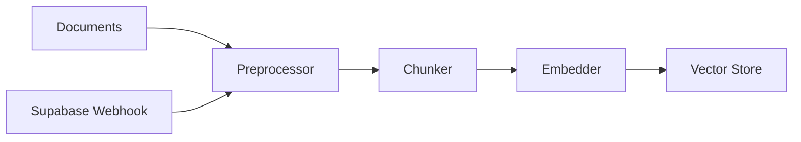
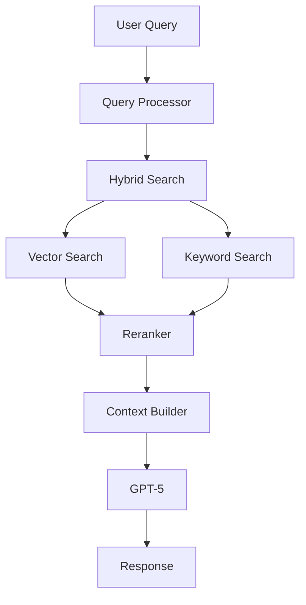
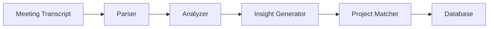

# Ultimate PM Agent - Project Planning Document

## Executive Summary
Building a state-of-the-art Project Management RAG (Retrieval-Augmented Generation) agent using GPT-5 and Next.js, designed to automatically vectorize documents, generate meeting insights, and provide intelligent chat-based project management capabilities.

## Core Objectives
1. **Automated Document Vectorization**: Process and embed all project documents for semantic search
2. **Meeting Intelligence**: Extract actionable insights from meeting transcripts
3. **Project Association**: Automatically link insights to relevant projects
4. **Leadership Chat Interface**: Provide conversational access to organizational knowledge

## Technology Stack

### AI/ML Stack
- **LLM**: GPT-5-nano (primary), GPT-5 (premium features)
- **Embeddings**: OpenAI text-embedding-3-small
- **Vector Store**: Supabase with pgvector extension
- **RAG Framework**: Custom implementation with hybrid search

### Application Stack
- **Frontend**: Next.js 14 App Router, React 18, TypeScript
- **Backend**: Next.js API Routes, Edge Functions
- **Database**: Supabase PostgreSQL with pgvector
- **Realtime**: Supabase Realtime subscriptions
- **Auth**: Supabase Auth with RLS

## System Architecture

### 1. Vectorization Pipeline


**Key Features:**
- Adaptive chunking (1000-2000 tokens)
- Semantic + temporal chunking for meetings
- Metadata extraction and enrichment
- Automatic processing on document insert
- Batch processing for efficiency

### 2. RAG System Design


**Components:**
- **Hybrid Search**: 70% vector, 30% keyword weighting
- **Context Management**: 8000 token window optimization
- **Reranking**: Relevance scoring with deduplication
- **Source Attribution**: Track document sources

### 3. Meeting Insights Pipeline


**Stages:**
1. Transcript parsing with speaker identification
2. Action item extraction
3. Decision identification
4. Risk assessment
5. Confidence scoring
6. Automatic project assignment

## GPT-5 Integration Strategy

### Model Configuration
```typescript
const gpt5Config = {
  model: "gpt-5-nano",     // Cost-efficient default
  verbosity: "medium",      // Adjustable per context
  reasoning_effort: "standard",
  stream: true,
  context_free_grammar: customCFG
};
```

### Prompt Architecture
Following GPT-5 best practices:
- **Structured prompts** with labeled sections
- **Bullet points** over paragraphs
- **Explicit search criteria** for context gathering
- **Parallel query strategies** for efficiency
- **Reasoning context reuse** across turns

### Tool Integration
```typescript
const tools = [
  {
    name: "search_documents",
    description: "Search project documents",
    parameters: { query, filters, limit }
  },
  {
    name: "generate_insights",
    description: "Extract insights from content",
    parameters: { content, project_context }
  },
  {
    name: "match_project",
    description: "Match content to projects",
    parameters: { content, confidence_threshold }
  }
];
```

## Database Schema Extensions

### Vector Tables
```sql
-- Documents table with vectors
ALTER TABLE documents 
ADD COLUMN embedding vector(1536),
ADD COLUMN chunk_metadata jsonb;

-- Meeting chunks with multi-dimensional embeddings
ALTER TABLE meeting_chunks
ADD COLUMN embedding vector(1536),
ADD COLUMN temporal_embedding vector(768),
ADD COLUMN relational_embedding vector(768);

-- Create indexes for similarity search
CREATE INDEX ON documents USING ivfflat (embedding vector_cosine_ops);
CREATE INDEX ON meeting_chunks USING ivfflat (embedding vector_cosine_ops);
```

### Insights Enhancement
```sql
-- Enhanced insights table
ALTER TABLE ai_insights
ADD COLUMN vector_sources jsonb[],
ADD COLUMN reasoning_trace text,
ADD COLUMN auto_assigned boolean DEFAULT false;
```

## User Experience Design

### Dashboard Layout
1. **Home Dashboard**
   - Project overview with health metrics
   - Recent insights summary
   - Quick chat access

2. **Meeting Intelligence**
   - Timeline view of meetings
   - Insight cards with actions
   - Project assignment interface

3. **Document Management**
   - Upload interface with progress
   - Vectorization status dashboard
   - Search and filter capabilities

4. **Leadership Chat**
   - Conversational interface
   - Context panel showing sources
   - Verbosity controls (GPT-5 feature)
   - Export and sharing options

## Performance Targets

### System Metrics
- **Vectorization**: < 2 seconds per document
- **RAG Retrieval**: < 500ms latency, > 0.85 relevance
- **Insight Generation**: < 10 seconds per meeting
- **Chat Response**: < 2 seconds to first token
- **System Availability**: 99.9% uptime

### Quality Metrics
- **Retrieval Accuracy**: > 85% relevant results
- **Insight Quality**: > 80% actionable insights
- **Project Matching**: > 75% correct assignment
- **User Satisfaction**: > 90% positive feedback

## Security & Compliance

### Data Protection
- End-to-end encryption for sensitive documents
- Row Level Security (RLS) on all tables
- API key rotation and management
- Audit logging for all operations

### Access Control
- Role-based permissions (Admin, Manager, User)
- Project-level access restrictions
- Document classification levels
- Meeting participant visibility controls

## Deployment Strategy

### Phase 1: MVP (Week 1-2)
- Core vectorization pipeline
- Basic RAG search
- Simple chat interface

### Phase 2: Intelligence (Week 2-3)
- Meeting insights generation
- Project auto-assignment
- Enhanced chat features

### Phase 3: Polish (Week 3-4)
- Dashboard and analytics
- Performance optimization
- User feedback integration

### Phase 4: Scale (Week 4+)
- Multi-tenant support
- Advanced analytics
- Integration APIs

## Risk Mitigation

### Technical Risks
- **Vector drift**: Regular reindexing schedule
- **Context overflow**: Intelligent chunking and compression
- **API limits**: Request queuing and caching
- **Model costs**: Tiered model usage (nano/mini/full)

### Operational Risks
- **Data quality**: Validation and cleaning pipelines
- **User adoption**: Intuitive UI and onboarding
- **Scalability**: Horizontal scaling architecture
- **Compliance**: Regular security audits

## Success Criteria

### Quantitative
- Process 1000+ documents with 99% success rate
- Generate insights from 100+ meetings
- Achieve < 5 second end-to-end response time
- Maintain > 90% user satisfaction score

### Qualitative
- Seamless integration with existing workflows
- Intuitive user experience requiring minimal training
- Valuable insights that drive decision-making
- Reduced time spent searching for information

## Next Steps

1. **Immediate Actions**
   - Set up development environment
   - Configure Supabase with pgvector
   - Initialize Next.js project
   - Create base component library

2. **Week 1 Goals**
   - Complete vectorization pipeline
   - Implement basic RAG search
   - Deploy initial chat interface

3. **Ongoing Activities**
   - Daily progress reviews
   - Weekly stakeholder updates
   - Continuous performance monitoring
   - User feedback collection

## Appendix

### Meeting Transcript Examples
- Located in `/documents` folder
- Variety of meeting types (operations, design, planning)
- Different formats and structures
- Speaker identification challenges

### Supabase Schema
- Full schema in `types/database.types.ts`
- Key tables: documents, meetings, meeting_chunks, projects, ai_insights
- Existing vector columns in some tables
- RLS policies to be implemented

### GPT-5 Best Practices Applied
1. **Verbosity control** for different use cases
2. **Reasoning effort** optimization for performance
3. **Context-free grammar** for structured outputs
4. **Parallel tool calling** for efficiency
5. **Streaming responses** for better UX

---

*This planning document serves as the blueprint for implementing the Ultimate PM Agent. It will be updated as the project progresses and new requirements emerge.*